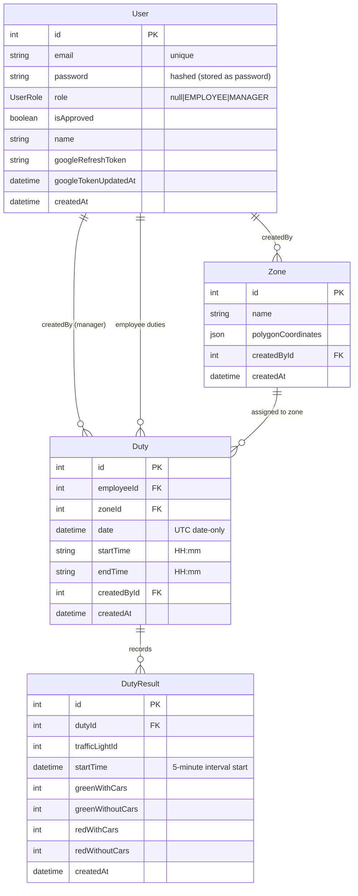

# Diagrams (Exam-Requirement Aligned)

## ER Diagram (Mermaid)



## UML Use Case Diagram (Mermaid)
```mermaid
usecaseDiagram
  actor Manager
  actor Employee
  actor "Unregistered User" as Unreg
  actor "Google OAuth" as Google
  actor "Google Calendar (optional)" as Cal

  Unreg --> Register : register()
  Unreg --> Login : login(email,password)

  Unreg --> (Login via Google) : OAuth login()
  Google --> (Login via Google)

  Manager --> "Approve user" : confirm pending -> set role=employee
  Manager --> "Create zone" : draw polygon + save
  Manager --> "Assign duty" : choose employee,date,startTime,endTime,zone

  Employee --> "View duties" : GET /duties (own duties)
  Employee --> "Submit duty results" : POST /duty-results/bulk (5-min intervals)

  Manager --> "Generate report" : select zone + date range -> aggregated buckets

  Manager --> (Create duty event) : optional calendar event
  Cal --> (Create duty event)
```

## Deployment Diagram (Mermaid)
```mermaid
flowchart LR
  Browser[Browser (React/Leaflet)] --> FE[Frontend (Vite/React)]
  FE --> BE[Backend (Express/TypeScript, REST API)]
  BE --> DB[(MySQL + Prisma)]
  FE -->|OSM tiles| OSM[(OpenStreetMap)]
  FE -->|Polygon drawing UI| BE
  BE -->|Google OAuth| GOAuth[(Google OAuth)]
  BE -->|Optional reminders/events| GCal[(Google Calendar API)]
```

## IDEF0 Level 0 + Level 1

### A0: Duty Scheduling Information System with Reporting
- Inputs (I)
  - User registration/login (email+password and Google OAuth code)
  - Zone polygon coordinates drawn on map
  - Manager duty assignment (employee, date, startTime, endTime, zone)
  - Employee duty results (per 5-minute interval: trafficLightId, startTime, 4 metrics)
  - Manager reporting parameters (zone + date range)
- Controls (C)
  - Role rules: `role = null` initially, manager approves -> `role = employee`
  - Manager access rules (JWT + role=MANAGER)
  - Employee submission rules (only approved duty owner)
  - Reporting rules: fixed time buckets 06:00–21:00 and required aggregation columns
- Outputs (O)
  - Persisted `Duty` records
  - Persisted `DutyResult` rows (5-minute intervals)
  - Manager-generated duty results report grouped by day
  - Optional Google Calendar events + reminders for duties
- Mechanisms (M)
  - Backend services (Express/TS), Prisma ORM
  - MySQL database
  - Leaflet + OpenStreetMap (polygon drawing)
  - Google OAuth (login) and optional Google Calendar API

### A1: User Approval & Roles
- Inputs (I): registration data / Google OAuth email
- Controls (C): unapproved users keep `role = null` until manager approves
- Outputs (O): approved employees have `role = EMPLOYEE` and `isApproved = true`
- Mechanisms (M): JWT, Prisma seed (default manager: `manager` / `12345`), roles endpoints

### A2: Zone Management (Polygon)
- Inputs (I): zone name + polygon points from Leaflet drawing UI
- Controls (C): manager-only access + polygon validation
- Outputs (O): `Zone` with `polygonCoordinates` stored in DB
- Mechanisms (M): Leaflet UI + backend zone service

### A3: Duty Scheduling
- Inputs (I): employeeId, date, startTime, endTime, zoneId
- Controls (C): manager-only access + employee must be approved
- Outputs (O): `Duty` created; optional calendar event created with reminders
- Mechanisms (M): duty service + optional Google Calendar integration

### A4: Duty Results Entry (5-minute intervals)
- Inputs (I): dutyId + per-interval duty result records
- Controls (C): employee-only; startTime must be within duty and 5-minute aligned
- Outputs (O): upserted `DutyResult` rows
- Mechanisms (M): duty-results service + Prisma upsert

### A5: Reporting (Fixed Buckets, Group by Day)
- Inputs (I): selected zone + date range
- Controls (C): time buckets {06-09,09-12,12-15,15-18,18-21} and required aggregation formulas
- Outputs (O): report aggregated per day and bucket with:
  - greenWithCars
  - greenWithoutCars + redWithoutCars
  - redWithCars
- Mechanisms (M): reporting service queries + aggregation logic

